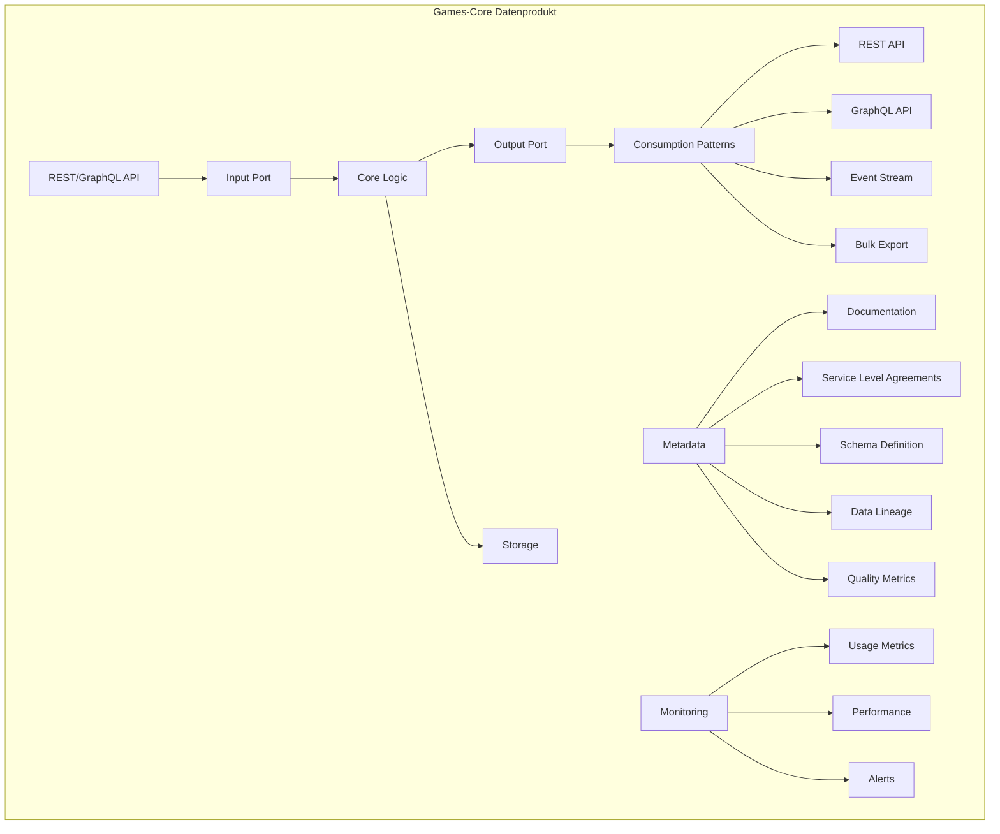
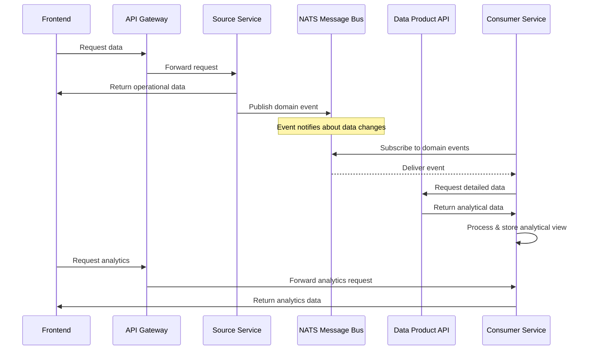
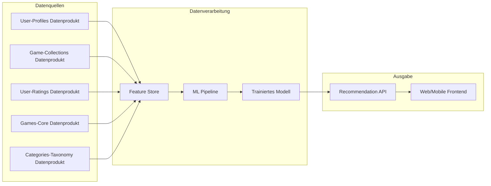
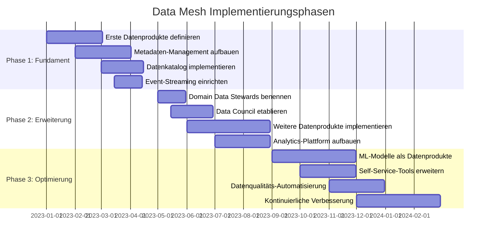

# Data Mesh Architektur-Diagramm

Dieses Dokument enthält eine visuelle Darstellung der Data-Mesh-Architektur für die Gesellschaftsspiel-Plattform. 

## Übergeordnete Data-Mesh-Architektur

```mermaid
graph TB
    subgraph "Self-Service Datenplattform"
        DataCatalog[Datenkatalog] --> SchemaRegistry[Schema Registry]
        DataCatalog --> QualityGateway[Quality Gateway]
        DataCatalog --> MetadataStore[Metadata Store]
        DataCatalog --> LineageTracker[Lineage Tracker]
    end

    subgraph "Governance"
        FederatedGovernance[Föderierte Governance] --> Standards[Gemeinsame Standards]
        FederatedGovernance --> DataCouncil[Data Council]
        FederatedGovernance --> ComplChecks[Compliance Checks]
        FederatedGovernance --> SLAs[SLAs]
    end

    subgraph "Library-Domain"
        LibraryDB[(Library DB)] --> GameProd[Games-Core Datenprodukt]
        LibraryDB --> CatProd[Categories-Taxonomy Datenprodukt]
        LibraryDB --> PubProd[Publishers-Catalog Datenprodukt]
        LibraryDB --> DesProd[Designers-Portfolio Datenprodukt]
        LibrarySteward[Domain Data Steward]
    end

    subgraph "Rating-Domain"
        RatingDB[(Rating DB)] --> UserRatProd[User-Ratings Datenprodukt]
        RatingDB --> RatAggProd[Rating-Aggregation Datenprodukt]
        RatingDB --> RatTrendProd[Rating-Trends Datenprodukt]
        RatingSteward[Domain Data Steward]
    end

    subgraph "Event-Domain"
        EventDB[(Event DB)] --> EventCalProd[Events-Calendar Datenprodukt]
        EventDB --> EventPartProd[Event-Participation Datenprodukt]
        EventDB --> LocEventProd[Location-Events Datenprodukt]
        EventSteward[Domain Data Steward]
    end

    subgraph "Community-Domain"
        CommunityDB[(Community DB)] --> UserProfProd[User-Profiles Datenprodukt]
        CommunityDB --> GameCollProd[Game-Collections Datenprodukt]
        CommunityDB --> SocialProd[Social-Graph Datenprodukt]
        CommunityDB --> GroupsProd[Groups-Activity Datenprodukt]
        CommunitySteward[Domain Data Steward]
    end

    subgraph "Marketplace-Domain"
        MarketplaceDB[(Marketplace DB)] --> ListingsProd[Active-Listings Datenprodukt]
        MarketplaceDB --> PriceProd[Price-Trends Datenprodukt]
        MarketplaceDB --> TransProd[Transaction-History Datenprodukt]
        MarketplaceDB --> SellerProd[Seller-Trust Datenprodukt]
        MarketplaceSteward[Domain Data Steward]
    end

    subgraph "Content-Domain"
        ContentDB[(Content DB)] --> ContentProd[Content-Catalog Datenprodukt]
        ContentDB --> EngageProd[Content-Engagement Datenprodukt]
        ContentDB --> AuthorProd[Author-Contributions Datenprodukt]
        ContentDB --> ContentRecProd[Content-Recommendations Datenprodukt]
        ContentSteward[Domain Data Steward]
    end

    subgraph "Datenkonsumenten"
        Analytics[Analytics Service]
        Recommendation[Recommendation Service]
        WebApp[Web Application]
        MobileApp[Mobile App]
        Reports[Business Reports]
        ML[Machine Learning]
    end

    LibrarySteward --> FederatedGovernance
    RatingSteward --> FederatedGovernance
    EventSteward --> FederatedGovernance
    CommunitySteward --> FederatedGovernance
    MarketplaceSteward --> FederatedGovernance
    ContentSteward --> FederatedGovernance

    GameProd --> DataCatalog
    CatProd --> DataCatalog
    PubProd --> DataCatalog
    DesProd --> DataCatalog
    
    UserRatProd --> DataCatalog
    RatAggProd --> DataCatalog
    RatTrendProd --> DataCatalog
    
    EventCalProd --> DataCatalog
    EventPartProd --> DataCatalog
    LocEventProd --> DataCatalog
    
    UserProfProd --> DataCatalog
    GameCollProd --> DataCatalog
    SocialProd --> DataCatalog
    GroupsProd --> DataCatalog
    
    ListingsProd --> DataCatalog
    PriceProd --> DataCatalog
    TransProd --> DataCatalog
    SellerProd --> DataCatalog
    
    ContentProd --> DataCatalog
    EngageProd --> DataCatalog
    AuthorProd --> DataCatalog
    ContentRecProd --> DataCatalog
    
    DataCatalog --> Analytics
    DataCatalog --> Recommendation
    DataCatalog --> WebApp
    DataCatalog --> MobileApp
    DataCatalog --> Reports
    DataCatalog --> ML
```

## Detaillierter Aufbau eines Datenprodukts

## Datenfluss in der Data-Mesh-Architektur

## Data-Mesh-Governance-Modell

```mermaid
graph TB
    subgraph "Zentrale Governance"
        DataCouncil[Data Council]
        GlobalStandards[Globale Standards]
        QualityFramework[Qualitäts-Framework]
        DataPolicies[Daten-Richtlinien]
    end
    
    subgraph "Domain Library"
        LibrarySteward[Domain Data Steward]
        LibraryStandards[Domain-Standards]
        LibraryQuality[Qualitätskriterien]
        LibraryOwnership[Daten-Ownership]
    end
    
    subgraph "Domain Rating"
        RatingSteward[Domain Data Steward]
        RatingStandards[Domain-Standards]
        RatingQuality[Qualitätskriterien]
        RatingOwnership[Daten-Ownership]
    end
    
    subgraph "Domain Event"
        EventSteward[Domain Data Steward]
        EventStandards[Domain-Standards]
        EventQuality[Qualitätskriterien]
        EventOwnership[Daten-Ownership]
    end
    
    DataCouncil --> LibrarySteward
    DataCouncil --> RatingSteward
    DataCouncil --> EventSteward
    
    GlobalStandards --> LibraryStandards
    GlobalStandards --> RatingStandards
    GlobalStandards --> EventStandards
    
    QualityFramework --> LibraryQuality
    QualityFramework --> RatingQuality
    QualityFramework --> EventQuality
    
    DataPolicies --> LibraryOwnership
    DataPolicies --> RatingOwnership
    DataPolicies --> EventOwnership
    
    LibrarySteward --> DataCouncil
    RatingSteward --> DataCouncil
    EventSteward --> DataCouncil
```

## Beispiel: Personalisierte Spielempfehlungen mit Data Mesh

## Implementierungsphasen des Data Mesh

## Legende

- **Datenprodukt**: Eine fachlich orientierte, eigenständige Einheit von Daten mit klaren Schnittstellen und Verantwortlichkeiten
- **Domain Data Steward**: Verantwortlicher für die Datenprodukte einer Domain
- **Data Council**: Domainübergreifendes Gremium für Governance-Standards
- **Self-Service-Plattform**: Zentrale Infrastruktur zur Unterstützung der Datenprodukt-Teams
- **Quality Gateway**: Mechanismus zur Sicherstellung der Datenqualität
- **Data Catalog**: Zentrales Verzeichnis aller verfügbaren Datenprodukte
- **Schema Registry**: Verwaltung der Datenstrukturen und -formate
- **Lineage Tracker**: Nachverfolgung der Datenherkunft und -transformation